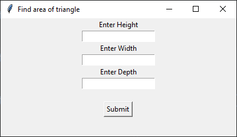
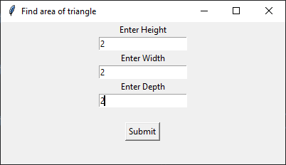
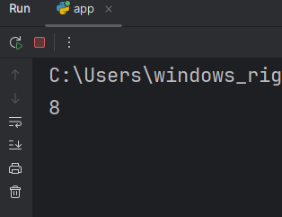
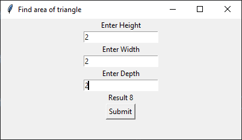
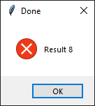

```python
import tkinter as tk
from tkinter import messagebox

root = tk.Tk()

root.geometry("400x400")

root.title("Find area of triangle")

# height = tk.IntVar()
# width = tk.IntVar()
# depth = tk.IntVar()

height_label = tk.Label(root, text="Enter Height")
height_entry = tk.Entry(root)

width_label = tk.Label(root, text="Enter Width")
width_entry = tk.Entry(root)

depth_label = tk.Label(root, text="Enter Depth")
depth_entry = tk.Entry(root)

height_label.pack()
height_entry.pack()

width_label.pack()
width_entry.pack()

depth_label.pack()
depth_entry.pack()

result_label = tk.Label(root, text="")
result_label.pack()


def calculate():
    result = int(height_entry.get()) * int(width_entry.get()) * int(depth_entry.get())
    print(result)
    result_label.config(text="Result {}".format(result))
    response = messagebox.showerror("Done", "Result {}".format(result))
    if response == "ok":
        pass

submit_button = tk.Button(root, text="Submit", command=calculate)
submit_button.pack()

root.mainloop()
```






