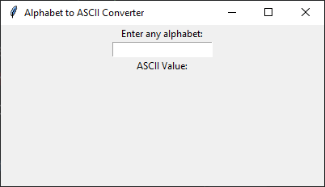

```python
import tkinter as tk

def convert_to_ascii(*args):
    value = alphabet_var.get()
    if len(value) == 1:  # Ensure a single character
        ascii_value.set(str(ord(value)))  # Convert ASCII to string and set
    else:
        ascii_value.set("")  # Clear if invalid input

root = tk.Tk()
root.geometry("400x400")
root.title("Alphabet to ASCII Converter")

# Variables
alphabet_var = tk.StringVar()
ascii_value = tk.StringVar()

# Attach trace function
alphabet_var.trace_add("write", convert_to_ascii)

# UI Components
alphabet_label = tk.Label(root, text="Enter any alphabet:")
alphabet_label.pack()

alphabet_entry = tk.Entry(root, textvariable=alphabet_var)
alphabet_entry.pack()

result_label = tk.Label(root, text="ASCII Value:")
result_label.pack()

ascii_label = tk.Label(root, textvariable=ascii_value, font=("Arial", 14))
ascii_label.pack()

root.mainloop()
```


